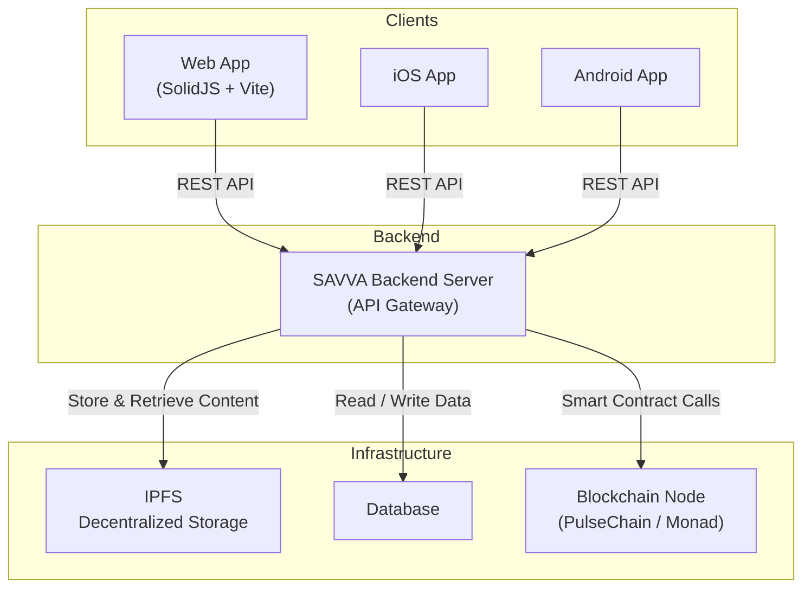

# SAVVA Platform - UI

A decentralized social media platform built on blockchain technology, featuring content monetization, governance, and community engagement tools.

## Features

- **Content Publishing** - Share posts, articles, and media with built-in IPFS integration
- **NFT Marketplace** - Mint and trade content NFTs
- **Staking & Governance** - Stake SAVVA tokens and participate in platform governance
- **Community Fundraising** - Support creators and projects through built-in fundraising
- **Multi-language Support** - English, Ukrainian, Russian, Spanish, French, Serbian
- **Web3 Integration** - Connect with MetaMask, Safe wallets, and other Web3 providers

## Tech Stack

- **Frontend**: SolidJS, Vite
- **Blockchain**: Ethereum-compatible (PulseChain)
- **Smart Contracts**: Solidity
- **Storage**: IPFS for decentralized content storage
- **Styling**: TailwindCSS with custom theming

## Architecture



## Prerequisites

- Node.js 18+
- npm or yarn
- Web3 wallet (MetaMask recommended)

## Installation

```bash
# Clone the repository
git clone https://github.com/your-org/savva-ui-solidjs.git
cd savva-ui-solidjs

# Install dependencies
npm install

# Copy environment template
cp .env.example .env

# Configure your .env file with required values
# See .env.example for all available options

# Run development server
npm run dev
```

## Development

```bash
# Start dev server
npm run dev

# Build for production
npm run build

# Run i18n scripts
npm run i18n

# Release (automated version bump, build, deploy)
npm run release
```

## Configuration

The app does **not require** any environment variables to run. All configuration is fetched from the blockchain Config contract at runtime.

Optional `.env` settings (copy `.env.example` to `.env`):

- **Deployment** - `DEPLOY_HOST`, `DEPLOY_USER`, `DEPLOY_PATH` for automated SSH deployment via `npm run release`
- **Git branches** - `GIT_MAIN_BRANCH`, `PROD_BRANCH` if your branches differ from defaults
- **OpenAI** - For Claude Code development tools only (not used by the app itself)

User-facing AI features (grammar fix, translation, etc.) are configured in the app's Settings page and stored in browser localStorage.

## Project Structure

```
src/
├── blockchain/      # Smart contract interactions
├── context/         # React/Solid context providers
├── i18n/           # Internationalization files
├── routing/        # App routing
├── styles/         # Global styles
├── x/              # Components and pages
│   ├── pages/      # Page components
│   ├── modals/     # Modal dialogs
│   ├── ui/         # Reusable UI components
│   └── ...
public/
├── dev_docs/       # Developer documentation
└── ...
```

## Smart Contracts

This UI connects to SAVVA smart contracts deployed on PulseChain:
- Config: `0x4ED8321722ACB984aB6B249C4AE74a58CAD7E4e8`
- See [Official Contract Addresses](public/dev_docs/en/licenses/official-contracts.md) for complete list

## Documentation

Developer documentation is available at: **https://savva.app/docs**

Local docs (in this repository):
- [Developer Docs](public/dev_docs/en/)
- [Connection Architecture](public/dev_docs/en/core-concepts/connection-orchestration.md)
- [Smart Contract Integration](public/dev_docs/en/core-concepts/config-contract.md)

## License

This project is licensed under GPL-3.0 with SAVVA Additional Terms.

**Important**: Any projects using this software must employ the official SAVVA blockchain contracts and token. You cannot create alternative tokens or replace the official contracts. See [LICENSE](LICENSE) for details.

## Contributing

We welcome contributions! Please see [CONTRIBUTING.md](CONTRIBUTING.md) for guidelines.

## Links

- Website: https://savva.app
- Documentation: https://savva.app/docs
- Telegram: https://t.me/savvaapp
- Android App: https://play.google.com/store/apps/details?id=app.savva.mobile

## Support

For issues and questions:
- GitHub Issues: [Report a bug](https://github.com/AlexNa-Holdings/savva-ui-solidjs/issues)
- Community: Join our platform at https://savva.app
